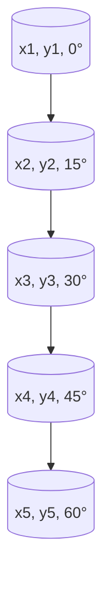

# 04 — NavFn vs Smac Search Spaces

## Why the same start and goal can produce very different paths

This page is the visual companion to [03-nav2-architecture.md](03-nav2-architecture.md).
The goal is simple: make it obvious why **NavFn** and **SmacPlanner** are solving
different planning problems, even when they are given the same map and the same goal.

---

## 1. NavFn: search over a 2D grid

NavFn thinks in terms of occupancy cells and traversal cost.

It asks:

> "Which sequence of free cells gets me from start to goal at minimum path cost?"

It does **not** directly reason about steering angle or minimum turning radius.

```text
Top-down grid view

####################
# S . . . . . . .  #
# . . . X X . . .  #
# . . . X X . . G  #
# . . . . . . . .  #
####################

NavFn state = (x, y)
```

The planner only needs to know where the robot is on the map. Heading is not part of the
search state.

### Grid-search intuition


This is why NavFn is fast and very reliable on warehouse maps, but it can produce a path
that is geometrically valid while still being awkward for a car-like robot to follow.

---

## 2. SmacPlanner: search over position plus heading

SmacPlanner Hybrid-A* thinks in a richer state space.

It asks:

> "Which sequence of feasible position-and-heading states gets me to the goal while
> respecting the robot's turning constraints?"

```text
Smac state = (x, y, theta)
```

That means two states at the same map location can still be different if the robot is
facing different directions.

```text
Same position, different states:

Cell A, heading east   -> (x, y, 0°)
Cell A, heading north  -> (x, y, 90°)
Cell A, heading west   -> (x, y, 180°)
```

### Pose-lattice intuition



The search is effectively moving through a **lattice of feasible vehicle poses**, not
just a floor grid.

---

## 3. Why minimum turning radius changes the answer

Suppose the map allows a sharp corner.

NavFn may happily route through that corner because the cells are free.

```text
NavFn sees:

....
...G
..X.
S...
```

But a car-like robot with a large minimum turning radius may not be able to rotate into
that corner tightly enough.

SmacPlanner accounts for that by searching curved motions that obey the configured
turning radius.


This is the key difference:

- **NavFn:** shortest path in the costmap
- **Smac:** shortest feasible path for the vehicle model

---

## 4. Why reverse motion changes the search space again

When Smac uses `motion_model_for_search: DUBIN`, it only explores forward-feasible
motions.

When it uses `motion_model_for_search: REEDS_SHEPP`, it can also explore reverse
maneuvers.

```text
Dubin search:        Reeds-Shepp search:

forward only         forward + reverse
arc / straight       arc / straight / reverse arc / reverse straight
```

That makes the search space larger, but it often makes the solution much shorter in
tight spaces such as docking, parking, and forklift alignment.

---

## 5. Engineering takeaway

Use **NavFn** when:

- the robot is effectively well-approximated as a point or diff-drive platform on a grid
- the environment is open enough that geometric feasibility is rarely the bottleneck
- you care most about planner simplicity and speed

Use **SmacPlanner** when:

- the robot is non-holonomic in a way that matters operationally
- turning radius is a real constraint
- the goal pose requires orientation-sensitive approach behavior
- reverse motion policy changes what should count as a valid path

---

## One-line summary

NavFn searches **where the robot can fit on the map**.
Smac searches **how the robot can actually drive there**.